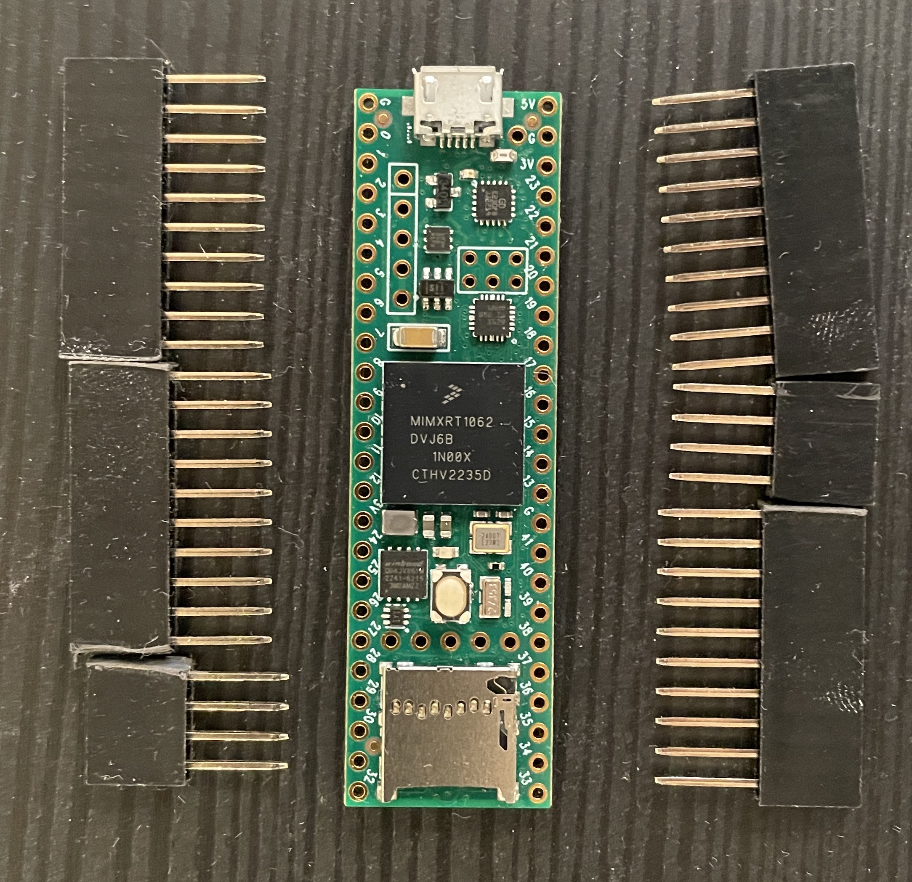
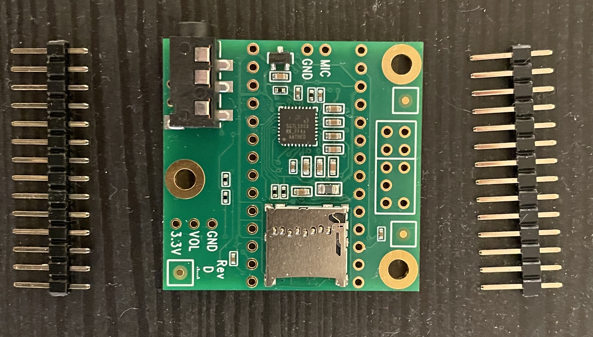
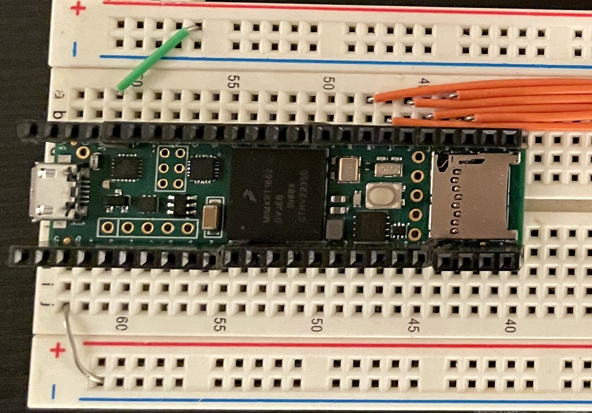
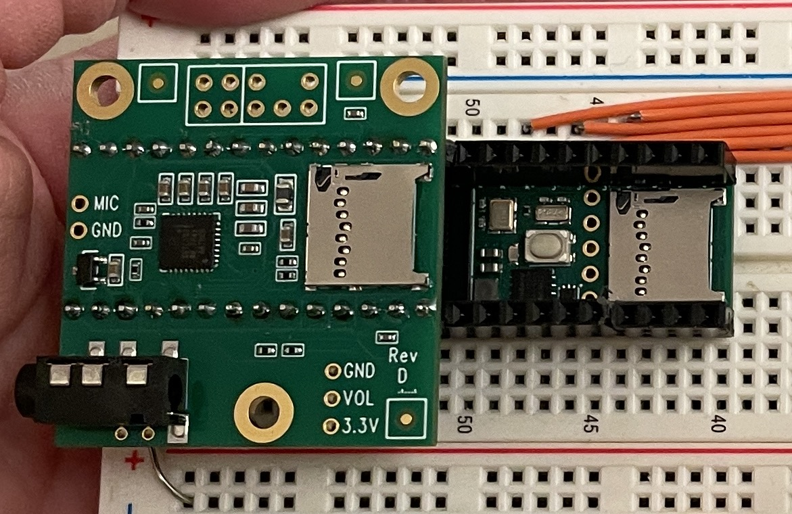

# Hardware & Setup

The first half of this class is taught using the [Teensy 4.1](https://www.pjrc.com/store/teensy41.html) and [Teensy 4.x Audio Shield](https://www.pjrc.com/store/teensy3_audio.html). I recommend purchasing these boards without pre-soldered pins so that you have more flexibility in how you will use them. Here is my example configuration that is flexible and compact.

# **Teensy 4.1 with 'Extra Long' Stacking Female Headers**

Solder extra long stacking header pins to your Teensy 4.x board. The solder should be on the bottom side of the board.

**Do not snip off the excess pin length!!**

We are using these extra long pins so that it will be possible to insert the pins into a breadboard, and also stack the audio board on top of the teensy itself.

[Like these](https://www.adafruit.com/product/2830)

# **Teensy 4.x Audio Shield with Standard Male Headers**

Solder standard 2.54mm male headers to your Teensy 4.x Audio Shield. The short part of the pin should be on the top of the board, with the longer part below. The solder joint goes on top of the board.

[Like these](https://www.amazon.com/Jabinco-Breakable-Header-Connector-Arduino/dp/B0817JG3XN/)

# **Assembly for Prototyping**

Insert the Teensy 4.x into a breadboard.

Stack the Audio Shield on top of it. This configuration allows for prototyping on a breadboard while remaining compact, and also leaves the possibility of using the boards in different contexts down the road.

